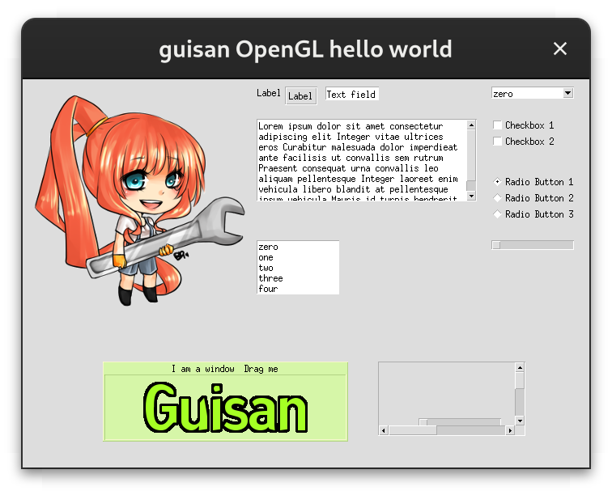

# GUISAN

## An SDL2 GUI construction toolkit

Check out the online [Doxygen documentation](https://codedocs.xyz/gbaudic/guisan).

Guisan was forked from Guichan to create a simple GUI construction toolkit that is compatible with SDL 2.0.0+. It is primarily intended for use in games. If you need a full-fledged GUI toolkit, other libraries like GTK+ or Qt will be more appropriate. 

It compiles and runs on Linux, Windows (MSYS2) and Windows (Visual Studio). Mac is not tested. 

## Features

* Statically links to your applications to reduce runtime requirements
* Small, but effective

## How to use

Check the wiki of this repo for a list of available widgets, some general advice on how to integrate into your programs. The examples and demo in the repo will be helpful too. 

## Build requirements

* scons
* pkg-config

## Runtime requirements

* SDL 2.0+
* SDL2_image
* SDL2_ttf
* SDL2_mixer (for the demo)

## Example

## License:

Released under the BSD license. See COPYING for more details. 
